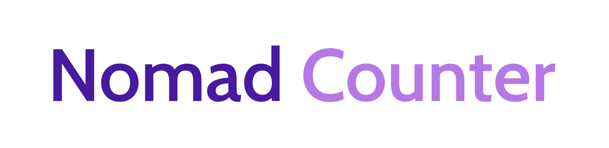
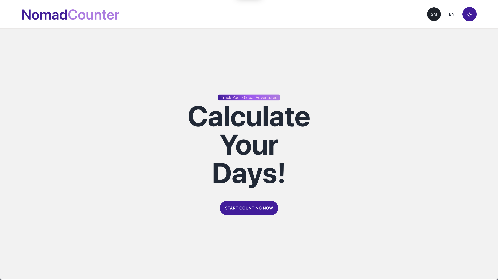

# Nomad Counter


<!-- Coming soon -->


## Demo ([Production Website](https://nomad.santi020k.me/))



## Description

Nomad Counter is an essential tool for travelers and adventurers worldwide. This application, available in both Spanish and English, allows you to keep a precise record of your time spent in different countries, including days spent at airports during layovers or connections.

Have you ever wondered how many days you've spent exploring a country, even counting those unforgettable moments at airports? Nomad Counter provides you with the answer in a simple and efficient manner. Just input your travel details, including entry and exit dates for each country, as well as the details of international airport layovers.

Key Features of Nomad Counter:

- **Stay Calculator:** Log your travels country by country and get the total duration of your stays in each one, whether you're visiting or in transit at an airport.

- **Travel History:** Access a complete history of your past journeys, allowing you to track your adventures and reminisce about your experiences in each destination.

- **Bilingual Support:** The app is bilingual, with support in both Spanish and English to cater to a global audience of travelers.

- **Notifications and Reminders:** Set up reminders so you never forget to log your travels and make the most of Nomad Counter.

- **Travel Statistics:** Visualize statistics and charts summarizing your journeys in a clear and easy-to-understand format.

Whether you're a frequent traveler, an occasional adventure seeker, or a digital nomad, Nomad Counter will help you keep an accurate record of your days in different countries and airports.
<!-- Coming soon -->
<!-- Download the app today and start counting your days of exploration around the world! -->

This project has the potential to be a valuable tool for travelers worldwide, allowing them to keep a record of their travel experiences and providing useful data for future trips.

## Environment Variables

To run this project, you will need to add the following environment variables to your .env file

`PUBLIC_SUPABASE_URL`

`PUBLIC_SUPABASE_ANON_KEY`

## Run Locally

Clone the project

```bash
  git clone https://link-to-project
```

Go to the project directory

```bash
  cd nomad-counter
```

Install dependencies

```bash
  npm install
```

Start the server

```bash
  npm run dev
```

## Commands

All commands are run from the root of the project, from a terminal:

| Command                   | Action                                           |
| :------------------------ | :----------------------------------------------- |
| `npm install`             | Installs dependencies                            |
| `npm run dev`             | Starts local dev server at `localhost:4321`      |
| `npm run build`           | Build your production site to `./dist/`          |
| `npm run preview`         | Preview your build locally, before deploying     |
| `npm run astro ...`       | Run CLI commands like `astro add`, `astro check` |
| `npm run astro -- --help` | Get help using the Astro CLI                     |

## Running Tests (coming soon)

To run tests, run the following command

```bash
  npm run test
```

## Deployment (coming soon)

To deploy this project run

```bash
  npm run deploy
```

## Screenshots


## Tech Stack (Pending)

**Client:** React, zustand, TailwindCSS

**Server:** Supabase

## Color Reference

| Color             | Hex                                                                |
| ----------------- | ------------------------------------------------------------------ |
| Primary |  #471AA0 |
| Secondary |  #B579E6 |
| Primary Dark |  #b296d6 |
| Secondary Dark |  #e2c8f6 |

## Features

- Light/dark mode toggle
- I18n
- Session with google

## Roadmap (coming soon)

- Additional browser support
- Add more integrations

## Feedback

If you have any feedback, please reach out to me at <info@santi020k.me>

## 🚀 About Me (coming soon)

Hi, I'm Santiago Molina! 👋

I'm a full stack developer...

## Authors

- [@santi020k](https://www.github.com/santi020k)

## 🔗 Links

[](https://santi020k.me/)
[](https://www.linkedin.com/in/santi020k/)
[](https://twitter.com/santi020k)

## Contributing (coming soon)

Contributions are always welcome!

See `contributing.md` for ways to get started.

Please adhere to this project's `code of conduct`.

## License

[MIT](https://choosealicense.com/licenses/mit/)
